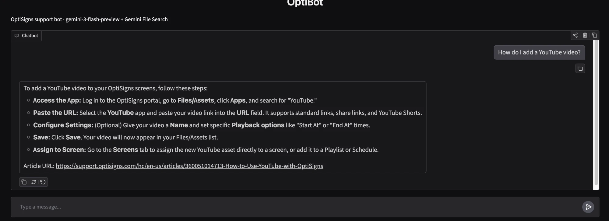

# chatbot-clone

Scrapes the OptiSigns Help Center, normalises every article to Markdown and keeps a Gemini
File Search store in sync, so an "OptiBot" assistant answers from the docs with cited URLs.
Runs daily and uploads only what changed.

**Daily job logs:** <https://github.com/duybaogitcode/chatbot-clone/actions/workflows/daily-sync.yml>
(each run's summary shows the counts; the `sync-N` artefact holds `last_run.json` + all Markdown).



Same question from the terminal (`python chat.py "..."`): [docs/screenshot-cli.png](docs/screenshot-cli.png)

## Setup & run locally

```bash
cp .env.sample .env                       # set API_KEY (Gemini, free tier); everything else is optional
python3 -m venv .venv && .venv/bin/pip install -r requirements-dev.txt
.venv/bin/python main.py                  # scrape -> articles/*.md -> upload delta
.venv/bin/python chat.py                  # OptiBot chat UI on http://localhost:7860
.venv/bin/pytest                          # 22 tests
```

Docker (runs once, exits 0):

```bash
docker build -t kb-sync-bot .
docker run --rm -e API_KEY=... kb-sync-bot main.py
```

Optional env: `STORE_ID` (pin a store; otherwise `optibot-kb` is found or created),
`DRY_RUN=1` (scrape + convert only), `MAX_ARTICLES=N` (quick partial run, never deletes).

## How it works

| Step | File | Notes |
|---|---|---|
| Scrape | `scraper.py` | Zendesk Help Center API (all 414 articles), paginated, retries on 429/5xx. |
| Clean | `converter.py` | Callout tables (~330 one-column "NOTE" boxes) → blockquotes; layout tables → flattened; iframes → links; inline base64 images dropped; root/protocol-relative URLs made absolute; in-page `#anchor` links kept working. |
| Chunk | `chunker.py` | See below. |
| Diff | `sync.py` | SHA-256 of each article's Markdown vs. the hash stored on its chunks → added / updated / skipped / removed. |
| Upload | `uploader.py` | Chunk documents uploaded to Gemini File Search with metadata; 429s retried with backoff; for updates the new chunks go in before the old ones are deleted. |
| Assistant | `chat.py` | The brief's system prompt verbatim + the File Search tool. |

**Chunking.** Articles are split on `##`/`###` headings (small sections merged, long ones split on
paragraph boundaries, never inside code blocks), max 350 tokens. Every chunk starts with
`Article URL:`, the title and the section path, because the system prompt cites
"Article URL:" lines and auto-chunking would leave that line only in a file's first chunk.
Each chunk is its own document under Gemini's 512-token chunk limit, so 1 document = 1
indexed chunk and the logged count is exact. Result: 414 articles → 2,080 chunks (median ~250 tokens).

**Delta without a database.** Each document carries `article_id`, `content_hash` and
`chunk_count` metadata, so a fresh container reads the store to learn what is already there.
Failed or missing chunks (e.g. a run stopped by the free-tier quota) make their article count as
changed, so the next run completes it.

**Why Gemini, and why `chat.py`.** I used Gemini's free tier. Google AI Studio's playground has no
File Search tool (only Google Search, Maps, URL context...), so the assistant is configured through
the API in `chat.py`, with the same verbatim system prompt, instead of in the AI Studio UI.

## Daily job

`.github/workflows/daily-sync.yml` runs tests, builds the image and runs it every day at
02:00 UTC (plus a manual "Run workflow" button). Secrets: `API_KEY`, `STORE_ID`.
Sample log line:

```
Run summary: {"articles_scraped": 414, "added": 0, "updated": 0, "skipped": 414, "removed": 0, "chunks_embedded": 0, ...}
```
